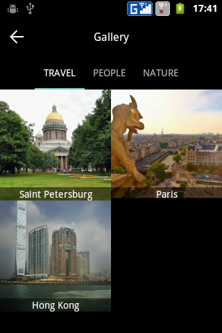

# Android gallery

Android Gallery - is an independent module that provides the possibilities of a full-fledged gallery. You can easily import module into your project.

Features:

* Ui customization without compilation;
* Multiple categories;
* Zoomable images.

