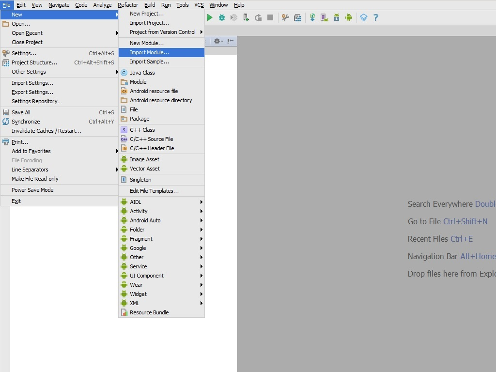
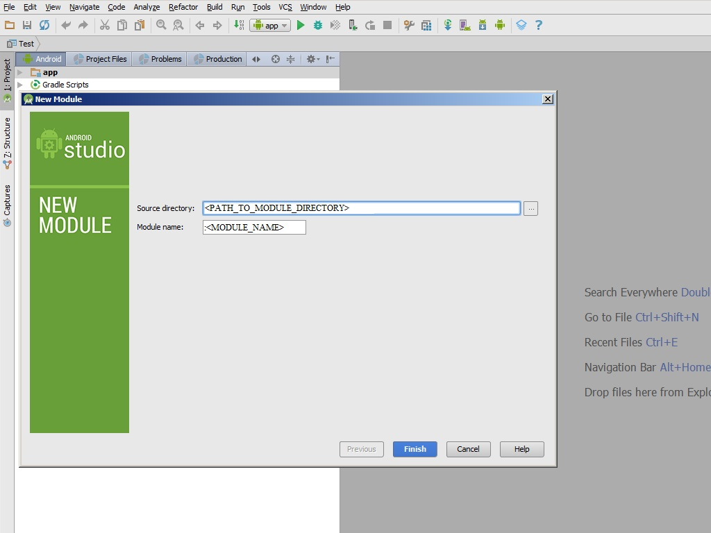

# Add module to project
For **Android Studio**:

1)File->New->Import Module:

2)Specify the path to the module directory:

After adding a module to the project you must include him to the dependency of the application.

1)File->Project Structure:
